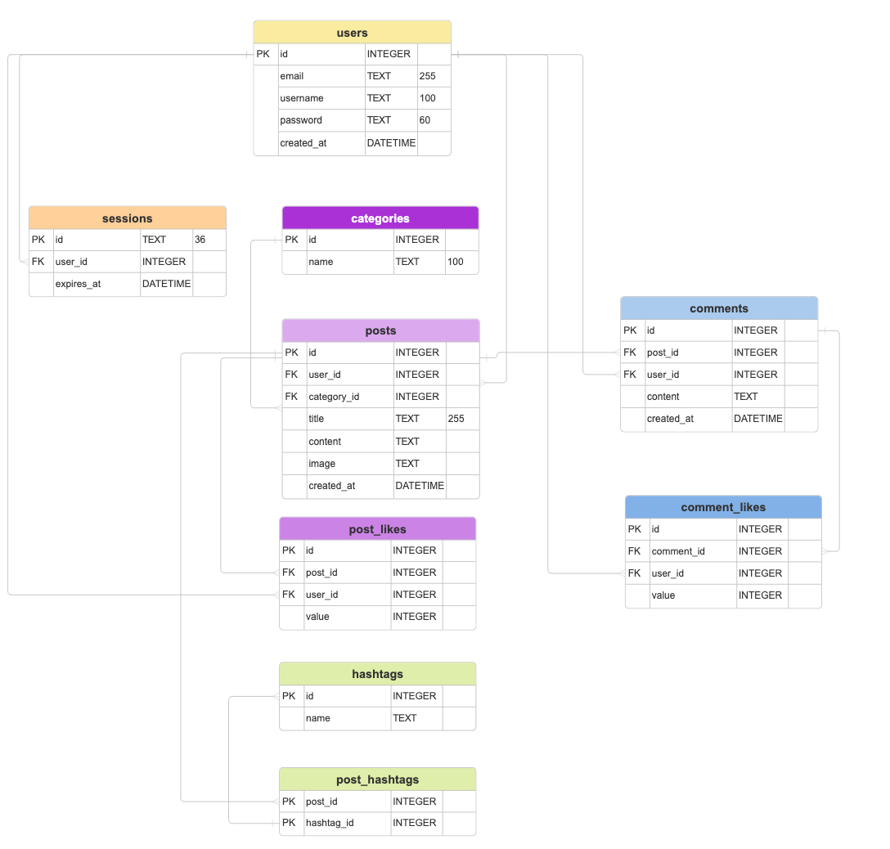

# Literary Lions Forum

**Literary Lions** is a web forum for book lovers, built in Go, using SQLite for persistent storage and Docker for easy deployment.

---

## Features

- User registration with **email, username, password**.
- Passwords stored securely (**bcrypt** hashing).
- **Sessions** using cookies & UUIDs for login persistence.
- Create/view posts and comments (**only for logged-in users**).
- Associate posts with **categories**.
- **Like/Dislike** posts and comments.
- View your posts, liked posts, and filter by category.
- Search for posts.
- User profiles.
- All data (users, posts, comments, etc.) stored in SQLite.
- **Dockerized**: build and run in one step.
- Graceful handling of HTTP errors.
- User-friendly error pages.

---

## 📂 Project Structure

```bash
.
├── cmd/server/main.go           # Entry point
├── internal/
│   ├── auth/                   # login, logout, signup handlers
│   ├── db/                     # DB layer & schema.sql
│   ├── middleware/             # session, error handler
│   ├── models/                 # Go structs
│   └── pages/                  # HTTP handlers for routes
├── web/
│   ├── static/                 # CSS, images
│   └── templates/              # HTML templates
├── Dockerfile
├── go.mod
├── go.sum
└── README.md
```

## 🚀 Getting Started

### 1. Clone and Build

```bash
git clone https://gitea.kood.tech/anastasiiaemelianova/literary-lions.git
cd literary-lions
docker build -t literary-lions .
```

### 2. Run the Application

```bash
docker run -p 8080:8080 literary-lions
```

Visit http://localhost:8080

## 🧑‍💻 Usage

- Register with email, username, password.
- Log in with your email and password.
- Create and comment on posts, like/dislike, browse by categories.
- See your own posts and likes in your profile.

## 🛠️ Database

### Entity Relationship Diagram (ERD)

Below is the Entity Relationship Diagram (ERD) for the forum database:


All tables are defined in internal/db/schema.sql
You can seed categories or test data via SQLite tools, e.g.:

```sql
INSERT INTO categories (name) VALUES ('Novels'), ('Poetry'), ('Science Fiction');
```

A sample `forum.db` file with demo users, posts, and comments is included.

- To use it, just keep `forum.db` in the project root — the app will use it automatically!
- If you want to reset, just delete `forum.db` and restart the app.

## 🧪 Testing HTTP Status/Error Handling

**404 Not Found**

```bash
curl -i http://localhost:8080/nonexistent
# Should return: HTTP/1.1 404 Not Found
```

**400 Bad Request**

```bash
curl -i -X POST -d "email=bad&password=" http://localhost:8080/signup
# Should return: HTTP/1.1 400 Bad Request (if you modify your handler to use 400)
```

**401 Unauthorized**

```bash
curl -i http://localhost:8080/createpost
# Should redirect (302 or 303), or you can edit to respond with HTTP 401 if you wish
```

**500 Internal Server Error**
You can simulate a panic or DB error. For example, in any handler, add:

```go
panic("Simulate server error!") // just for test, then remove
```

or use a test route:

```go
mux.HandleFunc("/simulate-500", func(w, r) {
    middleware.ErrorHandler(w, 500, "Simulated internal error", false, "")
})
```

then

```bash
curl -i http://localhost:8080/simulate-500
# Should return: HTTP/1.1 500 Internal Server Error
```

**503 Service Unavailable**

```go
mux.HandleFunc("/simulate-503", func(w, r) {
    middleware.ErrorHandler(w, 503, "Forum is temporarily unavailable.", false, "")
})
```

```bash
curl -i http://localhost:8080/simulate-503
```

## 🏗️ Development

Hot reload: For dev, run

```bash
go run ./cmd/server/main.go
```

and visit localhost:8080

## 🏗️ Design

https://www.figma.com/design/eWAya9ywszu19WwExwH6Rd/Untitled?node-id=0-1&p=f

## 🗃️ Scalability

The forum database is modeled with an Entity Relationship Diagram (ERD) that already includes tables and relationships for hashtags.

All relevant tables (including hashtags and post_hashtags) are defined in:
internal/db/schema.sql

This allows easy extension for hashtag features—the groundwork is ready!
Soon, users will be able to tag posts with hashtags, and filter or search posts by hashtag for even better scalability and organization.

## 📄 License

This project is for educational/demo purposes.
